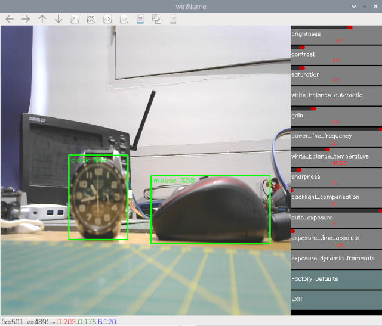

# Pi_USB_Hailo_Detect

Detects objects and saves MP4 videos, using USB camera, pi5 and hailo hat.

To setup the hailo..

 sudo apt install hailo-all
 
reboot

 git clone --depth 1 https://github.com/raspberrypi/picamera2
 
reboot

sudo apt install python3-opencv -y

put detectUSB.py in /home/USERNAME/picamera2/examples/hailo

Captures .mp4 videos  in /home/USERNAME/Videos

set required objects in objects = ["person","dog","cat"]

tested on Pi5, hailo, logitech c270.
